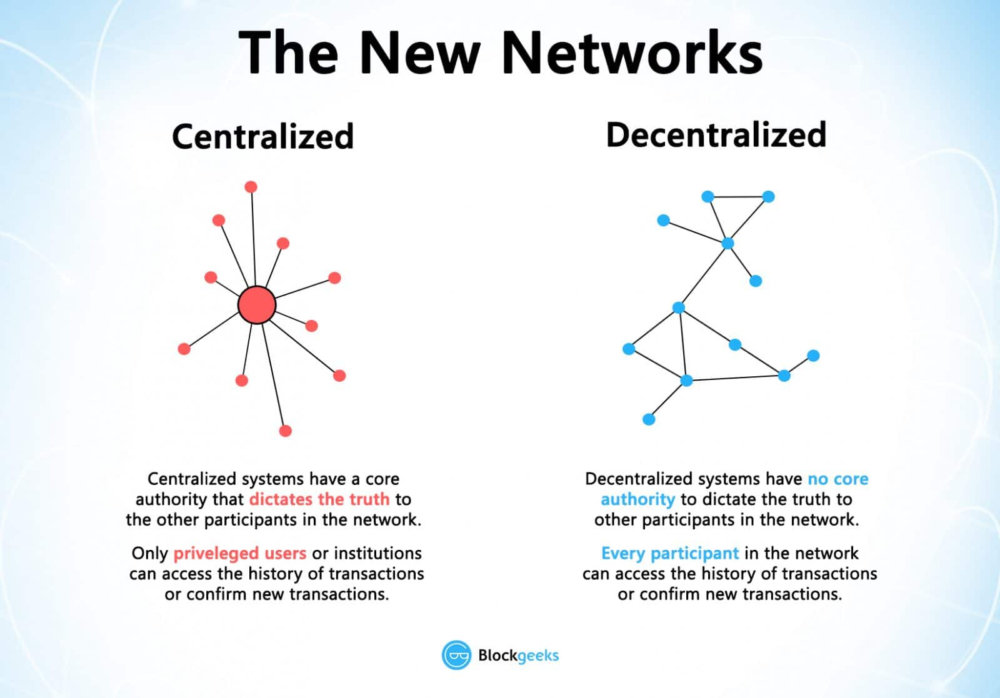

# Blockchain Resources
Resources to learn and develop blockchain applications for everyone.

I have created this repository as there are not many resources on Blockchain. This repository has been created for those who are curious about this technology and wants to deep dive into it. **Everyone's invited to add more resources by create pull requests.**
I will be adding links to articles, books, YouTube videos and GitHub repos for deep theoretical as well as hands-on knowledge.

### Pre-requisites
- Basic knowledge of data structures.
- Understanding about any object-oriented language - C++, Java, JavaScript etc.
- Starring :star2: this repo! 

## What is Blockchain?
First of all, it's not Bitcoin! Bitcoin or cryptocurrency is just an application of blockchain technology.
> In simple words, blockchain is a chain or series of block of immutable data in a time-stamped chronological order.

It's almost tamper-proof due to very strong cryptographic functions. It's completely decentralized i.e. no central authority controls it. It's managed by all the members of the network. This tech is rapidly being adopted by banking sector, government authorities as well as enterprises. 

## Features of blockchain
- ### Immutable
This means that once the data has been entered into the blockchain, it can't be changed or deleted. This property helps in building the trust between two parties. Cryptographic hash functions such as SHA-256, Keccak-256 provide the security and immutability to the blockchain. These functions take an input string of any length and give output string of a fixed length, it's called **hashing**. With the use of cryptography, there's a **avalanche effect** i.e. a small change in data results in a significant change in the output. This makes the hashing almost unbreakable.

- ### Decentralized
Currently, most of the platform you use have a centralized database i.e. there's a single entity that store all of your data and you have to fetch data from that entity only. For eg. Banks store all the data related to your transactions and charges you for handling all of that for you. Moreover, as all data is centralized, it's more vulnerable to attacks. There is also a chance of failure of the system so it can cause loss of valuable data. In blockchain, the concept is totally different - it's decentralized. In decentralized system, the information is stored by all the members of the network, not just one single entity. You can directly access the data and there is no single point of failure.

- ### Transparency and anonymity
Every single transaction/data on the blockchain is visible to everyone. There's one more thing to the transparency which is anonymity. Identity of the user is kept secret on the network, so you can transfer data to anyone without being known. Due to transparency, it's more trustable and secure.

### Read and watch more :eyes: -
1. Investopedia - https://www.investopedia.com/terms/b/blockchain.asp
2. Wired - https://youtu.be/hYip_Vuv8J0
3. Blockgeeks - https://blockgeeks.com/guides/what-is-blockchain-technology/
